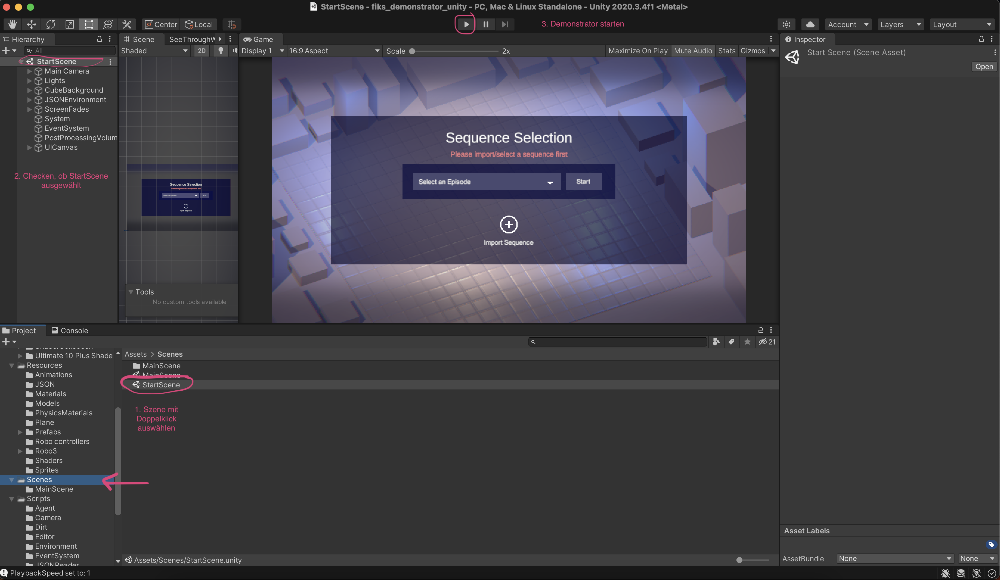
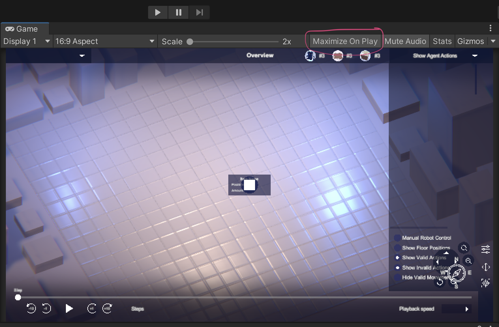

# FIKS_Demonstrator_Unity

This 3D-Demonstartor is part of a collabortion between the LMU Munich and the Fraunhofer-Institut für Kognitive Systeme. Its purpose is to visualize the training behavior of machine learning agents in a factory-like environment. The agents are trained using reinforcement learning. The Unity 3D-environment is supposed to help the user understand and further inspect agents' actions and provide interactive tools. Such tools are being able to navigate through episodes of different training sequences step-wise in a video-player like UI, as well as spacially navigate through the 3D environment. Details regarding each player's current action and its validity status are displayed. Animations illustrate the agent actions and environment state. 

For the future, even more ways of interaction are desirable, like being able to intervene into the scene and get real time agent reactions of e.g. manually placing an obstacle into the scene. This would affort for the program to be able to handle real time input instead of handling a pre-recorded training sequence.

For now, all input like agent and environment data is read in and deserialized when starting the program. Different JSON files can be selected from the computer.
Each JSON file marks one pre-recorded sequence. The JSON file contains a header with constant variables and a list of episodes. An episode contains multiple steps, of which each holds variable information like agent positions, actions, validity etc.

## Unity Requirements
- Install **Unity Hub** [https://unity.com/de/download](https://unity.com/de/download)
- Install **Unity Version 2020.3.4f1** (if version not in preselection: find it here [https://unity3d.com/unity/whats-new/2020.3.4](https://unity3d.com/unity/whats-new/2020.3.4))

## Style guide and Prototype
In order to achieve a pleasant user experience and a coherent and appealing design, a Figma design guide as well as prototype was created. 
The style guide shows details about colors, fonts, button design (in their different states), icons etc.
- **Design guide:** https://www.figma.com/file/0DSr13TIOoEcvmphThmgkA/F-IKS_Demonstrator?node-id=0%3A1
- **Prototype:** https://www.figma.com/proto/0DSr13TIOoEcvmphThmgkA/F-IKS_Demonstrator?node-id=79%3A117&starting-point-node-id=79%3A117

# Getting Started

## Opening the project
- In the Unity Hub under "Projects" click "Open" on the upper right to **load the cloned project** from the folder on your computer
- double click the project to open it in Unity

- check which scene opens upon start: if the **StartScene** (with the familiar agent environment) is already open, you are good to go. Just press the play button. If an unnamed new scene opened, navigate to the StartScene and open it.

- if you want to test with a bigger view: check **"Maximize on Play"** in the game view window

## Scene Overview 

The two scenes contained in the project are the

- **StartScreen:** used for sequence selection and upload
- **MainScene:** containing the interactive player

## Script Overview

All scripts are held in different thematically organized folders. 

- **Agent:** contains Monobehavior scripts that are attached to the Agent prefab (GameObject) and descripe behavior of that object in the scene
- **Camera:** contains the CameraController script
- **Constants:** contains the AgentConstants script that holds fixed string variables
- **EnvironmentData:** contains all model classes used to deserialize the JSON file and hold that information
- **EnvironmentManager:** contains the EnvironmentStateMAnager script, which is the programs central control instance and is attached to an empty "System" object in the scene
- **EventSystem:** contains the InputManager
- **JSONReader:** contains the JSONReader class to deserailze the JSON file and load a file from the computer
- **Spawning:** contains the ObjectSpawner class to spawn (generate and place) new objects into the scene, and a SpawnerHelperClass
- **UI:** contains UI relevant scripts like e.g. a tooltip script attached to gameobjects for which a tooltip is supposed to be shown when hovering over, it also contains the CustomFileBrowser

# Scene Structures

## Start Scene 

The Start Scene is the first scene that opens up after the splash screen (TODO). It is used to select a sequence or upload a new sequence via a JSON file from your computer. It also contains a help button in the right hand top corner to show a prompt explaining how the demonstrator works. In the bottom of the screen the logos of all participating parties of the demonstrator are displayed.

The following paragraph explains the unity scene components of the scene. 

The first few GameObjects of the scene like the **Main Camera**, lights inside the **Lights** object, background cubes inside the **Cube Background** object as well as the **Floor** object are straight forward and static. They do not habe any interaction functionalities or scripts attached, they simply create the background environment.
The following two GameObjects **ScreenFades** and **UICanvas** make the user interface. The screen fades are simple image overlays on the top and bottom of the screen to enhance a vignette like visual effect. The UICanvas object contains the remaining UI elements. 

The component worth further explaination is the scrollview containing the different sequences that can be clicked on to open.

The sequences that are clickable are Button [Prefabs](#Prefabs) that are created dynamically, reading out the folder where all JSON files are stored. See [File Upload](#File Upload).

## Main Scene

#Prefabs 

#File Upload

