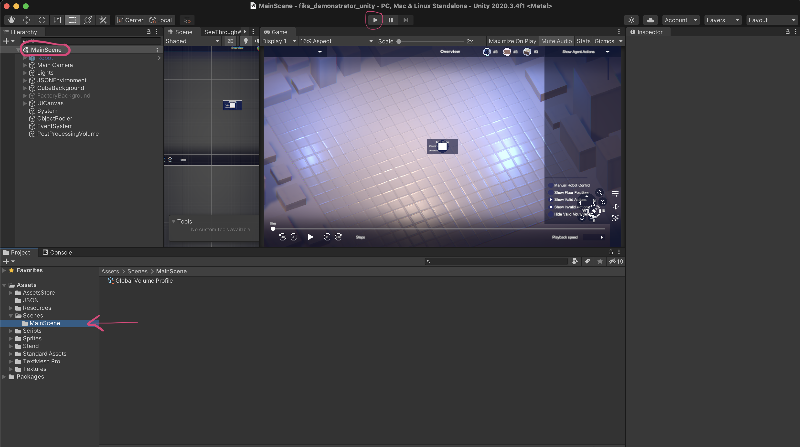

# FiKS_Demonstrator_Unity

**Unity Requirements**
- install Unity Hub [https://unity.com/de/download](https://unity.com/de/download)
- install Unity Version 2020.3.4f1 (if version not in preselection: find it here [https://unity3d.com/unity/whats-new/2020.3.4](https://unity3d.com/unity/whats-new/2020.3.4)

**Opening the project**
- in the Unity Hub under "Projects" load the cloned project from the folder on your computer
- double click the project to open it in Unity

- check which scene opens upon start: if the MainScene (with the familiar agent environment) is already open, you are good to go. Just press the play button. If an unnamed new scene opened, navigate to the MainScene and open it.

- if you want to test with a bigger view: check "Maximize on Play" in the game view window

