# FIKS_Demonstrator_Unity

This 3D-Demonstartor is part of a collabortion between the LMU Munich and the Fraunhofer-Institut für Kognitive Systeme. Its purpose is to visualize the training behavior of machine learning agents in a factory-like environment. The agents are trained using reinforcement learning. The Unity 3D-environment is supposed to help the user understand and further inspect agents' actions and provide interactive tools.  Tools like being able to navigate through episodes of different training sequences step-wise in a video-player like UI, as well as spacially navigating through the 3D environment. Details regarding each player's current action and its validity status are displayed. Animations illustrate the agent actions and environment state. 

For the future, even more ways of interaction are desirable, like being able to intervene into the scene and get real time agent reactions of e.g. manually placing an obstacle into the scene. This would affort for the program to be able to handle real time input instead of handling a pre-recorded training sequence.

For now, all input like agent and environment data is read in and deserialized when starting the program. Different JSON files can be selected from the computer.
Each JSON file marks one pre-recorded sequence. The JSON file contains a header with constant variables and a list of episodes. An episode contains multiple steps, of which each holds variable information like agent positions, actions, validity etc.

## Unity Requirements
- Install `Unity Hub` [https://unity.com/de/download](https://unity.com/de/download)
- Install `Unity Version 2020.3.4f1` (if version not in preselection: find it here [https://unity3d.com/unity/whats-new/2020.3.4](https://unity3d.com/unity/whats-new/2020.3.4))

## Style guide and Prototype
In order to achieve a pleasant user experience and a coherent and appealing design, a Figma design guide as well as prototype was created. 
The style guide shows details about colors, fonts, button design (in their different states), icons etc.
- `Design guide:` https://www.figma.com/file/0DSr13TIOoEcvmphThmgkA/F-IKS_Demonstrator?node-id=0%3A1
- `Prototype:` https://www.figma.com/proto/0DSr13TIOoEcvmphThmgkA/F-IKS_Demonstrator?node-id=79%3A117&starting-point-node-id=79%3A117

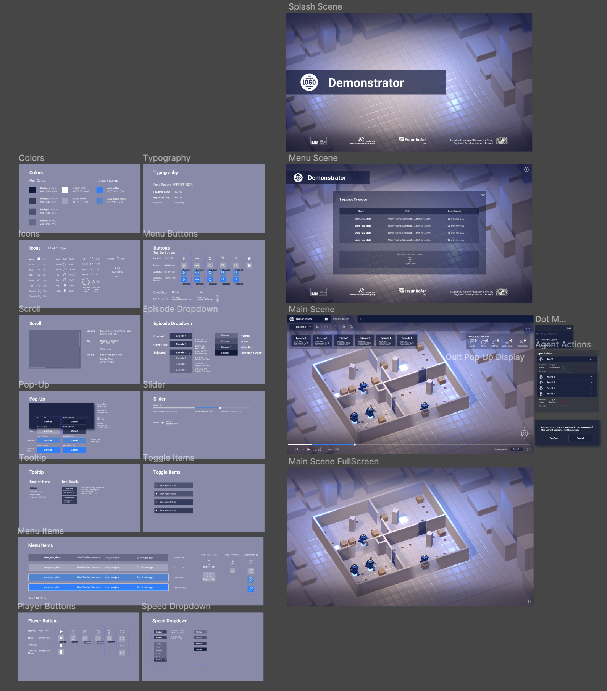

# Getting Started

## Opening the project
- In the Unity Hub under `Projects` click `Open` on the upper right to **load the cloned project** from the folder on your computer
- double click the project to open it in Unity

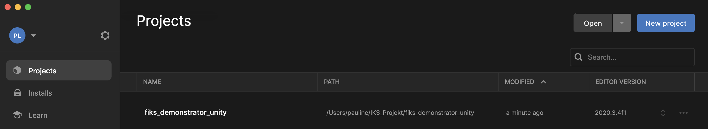

- check which scene opens upon start: if the `StartScene` (with the familiar agent environment) is already open, you are good to go. Just press the play button. If an unnamed new scene opened, navigate to the StartScene and open it.

- if you want to test with a bigger view: check `Maximize on Play` in the game view window

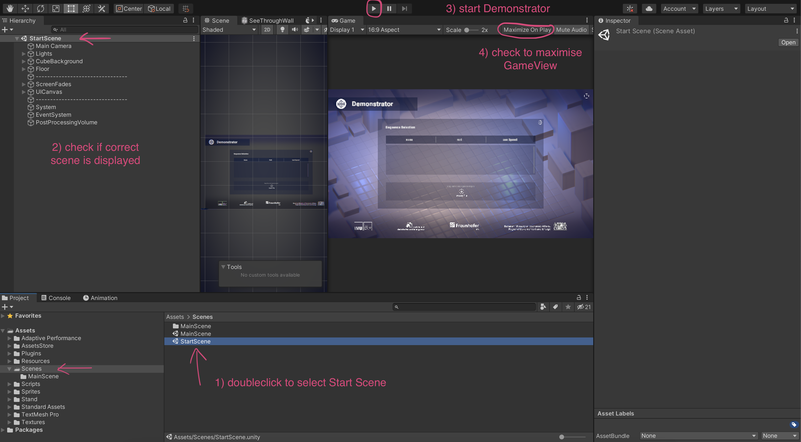

## Scene Overview 

The two scenes contained in the project are the

- `StartScreen`: used for sequence selection and upload
- `MainScene`: containing the interactive player

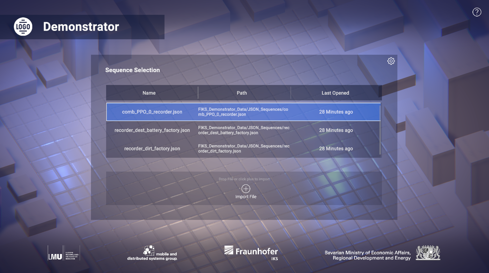
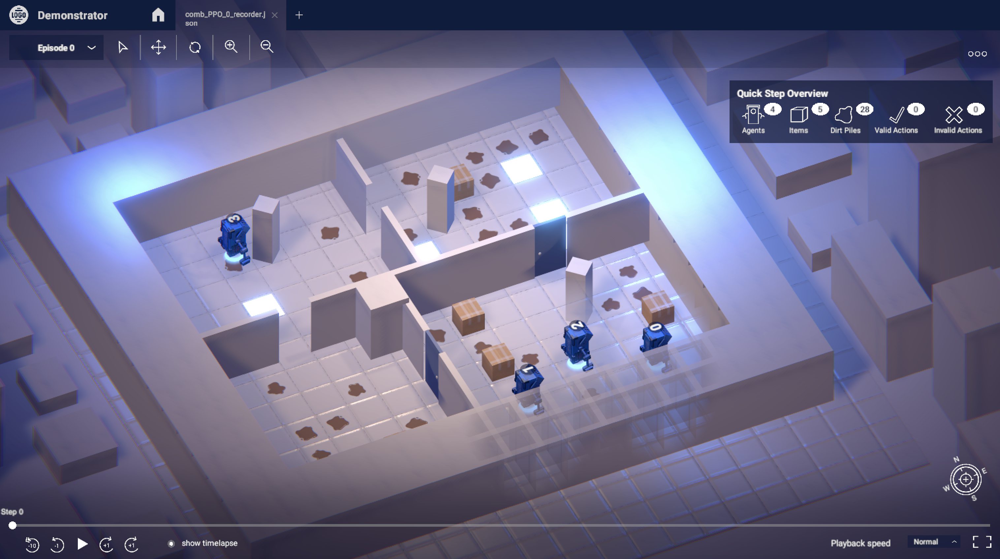

## Script Overview

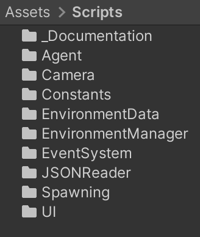

All scripts are held in different thematically organized folders. 

- `Agent`: contains Monobehavior scripts that are attached to the Agent prefab (GameObject) and descripe behavior of that object in the scene
- `Camera`: contains the CameraController script
- `Constants`: contains the AgentConstants script that holds fixed string variables
- `EnvironmentData`: contains all model classes used to deserialize the JSON file and hold that information
- `EnvironmentManager`: contains the EnvironmentStateMAnager script, which is the programs central control instance and is attached to an empty "System" object in the scene
- `EventSystem`: contains the InputManager
- `JSONReader`: contains the JSONReader class to deserailze the JSON file and load a file from the computer
- `Spawning`: contains the ObjectSpawner class to spawn (generate and place) new objects into the scene, and a SpawnerHelperClass
- `UI`: contains UI relevant scripts like e.g. a tooltip script attached to gameobjects for which a tooltip is supposed to be shown when hovering over, it also contains the CustomFileBrowser


# Scene Structures

## Start Scene 

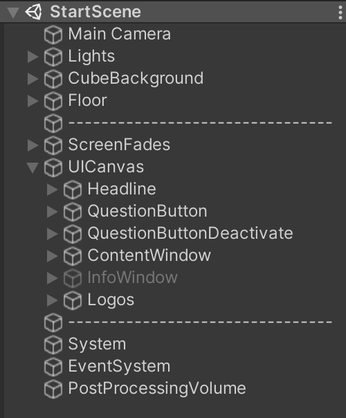

The `Start Scene` is the first scene that opens up after the splash screen (TODO). It is used to select a sequence or upload a new sequence via a JSON file from your computer. It also contains a help button in the right hand top corner to show a prompt explaining how the demonstrator works. In the bottom of the screen the logos of all participating parties of the demonstrator are displayed.

The following paragraph explains the unity scene components of the scene. 

The first few GameObjects of the scene like the `Main Camera`, lights inside the `Lights` object, background cubes inside the `Cube Background` object as well as the `Floor` object are straight forward and static. They do not habe any interaction functionalities or scripts attached, they simply create the background environment.
The following two GameObjects `ScreenFades` and `UICanvas` make the user interface. The screen fades are simple image overlays on the top and bottom of the screen to enhance a vignette like visual effect. The UICanvas object contains the remaining UI elements. 

The component worth further explaination is the scrollview containing the different sequences that can be clicked on to open.
The sequences that are clickable are Button [Prefabs](#Prefabs) called `FileItemButton` that are created dynamically (indicated blue in the left image below), reading out the folder where all JSON files are stored. See [File Upload](#File Upload).

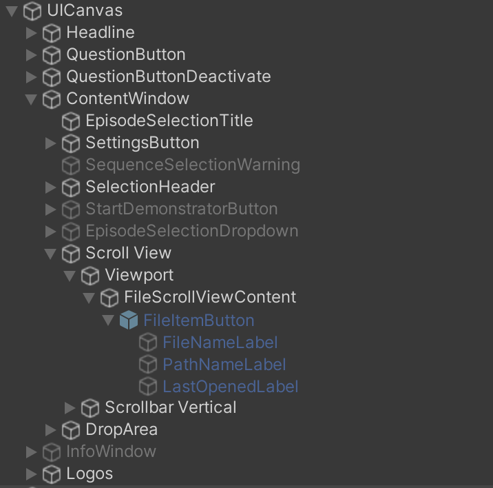
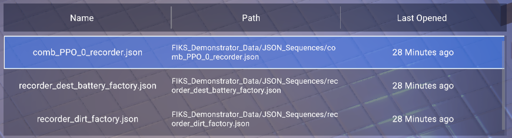

Finally, there is the empty `System` GameObject, that has the FileUpload logic contained in the `FileBrowserCustom` script attached to it.


## Main Scene

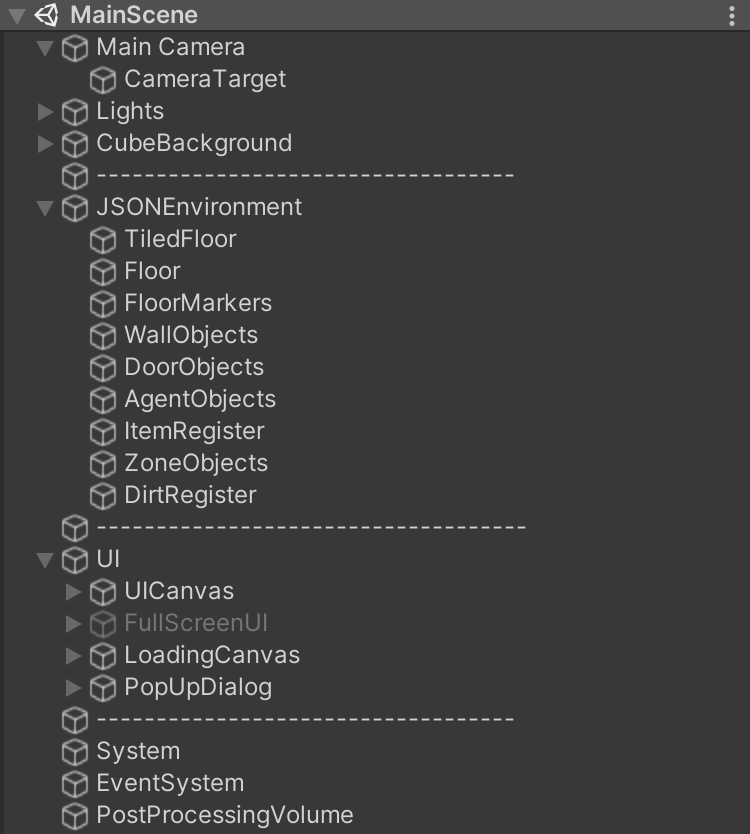

The Main Scene is the where the actual demonstrator takes place. Its UI is set up like a video player player. 

- `Main Camera`: In comparison to the Start Scene, the Main Scene's Main Camera has a Child Object called **Camera Target**. It is placed in the center of the environment but is not visible in the scene. It is simply used as an anchor for camera rotation. In the main scene, the camera also has the `Camera Controller` script attached. It is responsible for manual camera control like rotation, panning and zooming via keyboard, trackpad or mouse ineraction or button clicks.
- `Lights` and `CubeBackground` are the same as in the `StartScene`
- `JSONEnvironment`: besides the `Floor` objects (like in the `StartScene`) it contains empty objects like `WallObjects` etc. that are used as "Folders"/Parent objects for the different instances of door objects etc. that are read and spawned from the JSON file

The `UI` components consist of different canvases.

- `UICanvas`: The main UI elements
- `FullScreenUI`: deactivred by default, can be activted via `FullscreenButton`. Distracting elements like the timeslider etc. disappear.
- `LoadingCanvas`: contains a roting loading circle ([Asset: Animated Loading Icons)](https://assetstore.unity.com/packages/2d/gui/icons/animated-loading-icons-47844) and text display and is shown when the scene is started while the JSON data is processing.

The `System` empty GameObject contains all the major scripts that are handling the program flow. It has the scripts `JSONReader`, `EnvironmentStateManager`, `ObjectSpawner`, `InputManager` and `UIShowAndHide` attached to it.

# Prefabs 

A prefab is a component of (potentially nested) gameObjects that can be reused multiple times and spawned as an object. 

## Creating a Prefab

You can create one by dragging an object from the hierarchy in the unity editor into the `Prefabs` folder in the unity editor under `Assets/Resources/Prefabs`. If you want changes to affect all prefab instances, they need to be made on the prefab directly (you can click "Open Prefab" in the inspector on the left). In your scene structure you can recognize a prefab by its blue color. 
Some of the prefabs used in the demonstrator are the wall pieces, agents, dirt puddles, charging stations etc. 

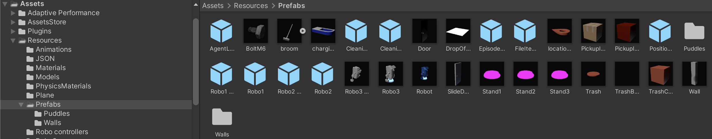

## Intantiating a Prefab

In the demonstrator, prefabs are instantiated in the `ObjectSpawner` class. It goes as followed:

```csharp
//Declare the object
GameObject RobotSpawnObject;

//Load resource
RobotSpawnObject = Resources.Load("Prefabs/Robot") as GameObject;

//Instatiate 
var newRobot = Instantiate(RobotSpawnObject, SpawnPosition, transform.rotation) as GameObject;

```

# File Browser

The script responsible for file upload is the `FileBrowserCustom` under `Scripts/UI/FileBrowserCustom`. It is using the AssetStore plugin ([SimpleFileBrowser)](https://assetstore.unity.com/packages/2d/gui/icons/animated-loading-icons-47844). 
The file browser allows only JSON files to be loaded by setting a `.json` or `.JSON` filter. 

## Uploading a file

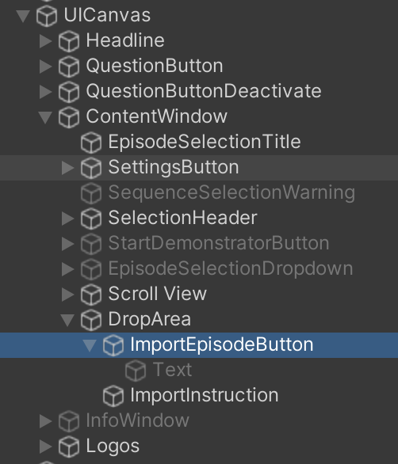
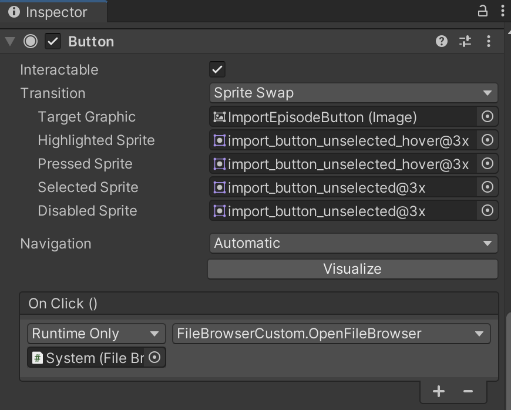

By clicking the `ÌmportEpisodeButton` in the `StartScene` the `OnClick()` method `FileBrowserCustom.OpenFileBrowser()` is triggered. This method sets the json filters and starts the Coroutine `ShowDialogCoroutine()` which yields the return `FileBrowser.WaitForLoadDialog()`. That means a pop up dialog opens containing a file browser in which the user can select a json file from their computer. If the file selevction was successful, the json is saved to the resources by:

```csharp
/// Read the bytes of the first file via FileBrowserHelpers
episodeDataString = FileBrowserHelpers.ReadTextFromFile(FileBrowser.Result[0]);
_filename = Path.GetFileName(FileBrowser.Result[0]);
SaveAsJSONToResources(_filename, episodeDataString);
```
## File Location

Once a file is selected, it is saved to a folder called `FIKS_Demonstrator_Data/JSON_Sequences`. If it does not exist yet, it is created as follows:

```csharp
if(!Directory.Exists("FIKS_Demonstrator_Data/JSON_Sequences")){
    Directory.CreateDirectory("FIKS_Demonstrator_Data/JSON_Sequences");
}
```

All files from that folder are displayed in the ScrollView via the method `FillScrollView()` by instantiating a `ListItemObject`.
Each ScrollView item is a Button with the following `OnClick(` method to start the Demonstrator (opening the main scene) passing the selected `filenam` through to the next scene.

```csharp
newItem.GetComponent<Button>().onClick.AddListener(()
    => StartDemonstrator(file.Name));
}
```

# JSON

The JSON Deserialization is handled through the `JSONReader` script attached to the `System` object in the `MainScene`. 

## JSON Format

All relevant data is stored within a nested JSON file. All nested JSON objects have a corresponding model `C# class` that is not a MonoBehavior but `[System.Serializable]` to store the data in a format to work with as objects. 
The top level object is `EnvironmentConstants`, containing the number of episodes `n_episodes`, environment paramneters with e.g. reward specifities `env_params` (not relevant in Unity yet), constant environment parameters that remain the same in each episode and step in a `header` and finally the episode Data in a list of `episodes`. 

Episodes can contain different types of objects, some, like e.g. `Items`,`Destinations`or `DirtPiles` are optional and are not necessarily included, that is why they are marked as optional with a `?`.

```csharp
[System.Serializable]
public class EnvironmentTimeStep
{
    public int step { get; set; }
    public List<Door>? Doors { get; set; }
    public List<Agent> Agents { get; set; }
    public List<Item>? Items { get; set; }
    public List<Inventory>? Inventories { get; set; }
    public List<Dirt>? DirtPiles { get; set; }
    public List<Destination>? Destinations { get; set; }
    public List<Destination>? ReachedDestinations { get; set; }
    public List<Battery>? Batteries { get; set; }

}
}
```
## JSON Deserialization

The actual deserialization takes place in the `JSONReader.ReadEnvironmentConstants()` method:

```csharp
private void ReadEnvironmentConstants()
    {
        constants = JsonConvert.DeserializeObject<EnvironmentConstants>(episodeDataString, new JsonSerializerSettings
        {
            NullValueHandling = NullValueHandling.Ignore
        });
    }
```
The `environmentDataString` parameter used is the string JSON data taken by using the previously passed through (from the SatrtScene scrollview) selected `filename` and selecting the correct JSON file from the `FIKS_Demonstrator_Data/JSON_Sequences` folder via `ReadSelectedJSONFile(string _filename)`:

```csharp
var info = new DirectoryInfo("FIKS_Demonstrator_Data/JSON_Sequences");
    var fileInfo = info.GetFiles();
    foreach (FileInfo file in fileInfo)
    {
        if (file.Name.Contains(_filename))
        {
            var source = new StreamReader(file.FullName);
            episodeDataString = source.ReadToEnd();
            source.Close();
        }
    }
```

# Object Spawning

The `ObjectSpawner` script is also attached to the `System` GameObject. The `EnvironmentStateManager` that is responsible for the program flow calls the ObjectSpawner method `SpawnNewEpisode()`, taking the `EnvironmentConstants` (=deserialized JSON data) and episode number as a input, upon start. It isd a wrapper function to call all other spawning functions for walls, doors, agents etc. :

```csharp
public void SpawnNewEpisode(EnvironmentConstants constantsInput, int episode)
    {
        constants = constantsInput;
        Debug.Log("#Walls Spawner Input: " + constantsInput.header.rec_Walls.Count);
        Debug.Log("#Walls Spawner: " + constants.header.rec_Walls.Count);
        spawnWalls(episode);
        spawnDoors(episode);
        spawnAgents(episode, 0);
        if (constants.episodes[episode].steps[0].Items != null) { spawnPickUpItems(episode, 0); }
        if (constants.header.rec_DropOffLocations != null) { spawnDropOffZones(episode, 0); }
        if (constants.episodes[episode].steps[0].DirtPiles != null) { spawnDirtRegister(episode, 0); }
        spawnFloorPositionMarkers(episode);
    }
```

## General Spawning

In general, to spawn an object, the corresponding prefab has to be instantiated in the scene as a GameObject using a given position and rotation, name and parent transform have to be set and it has to be added to the corresponding GameObject list in the `EnvironmentSateManager`. 

```csharp
var newPickupItem = Instantiate(objectToSpawn, SpawnPosition, transform.rotation) as GameObject;
            newPickupItem.name = name;
            newPickupItem.transform.parent = Items.transform;
            system.GetComponent<EnvironmentStateManager>().itemObjects.Add(newPickupItem);
```

## Object model vs. GameObject in scene

An important thing to mention is the distinction between the model class of an object that is deserialized from the JSON like e.g. `Agent` holding information from the rcorded sequence and the physical `GameObject` in the scene. The corresponding `GameObject` to an Agent is an instance of the `Robot` prefab. The scripts regarding the agent control are attached to the first child object `Robo3`.

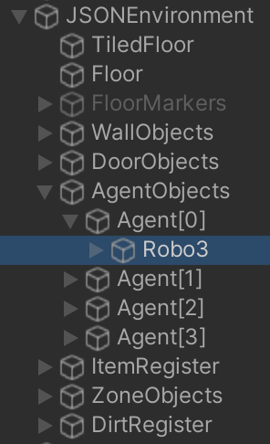


